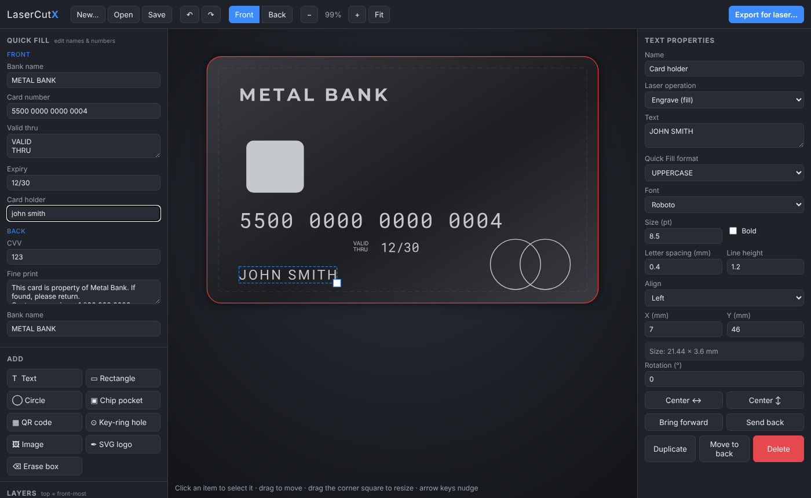
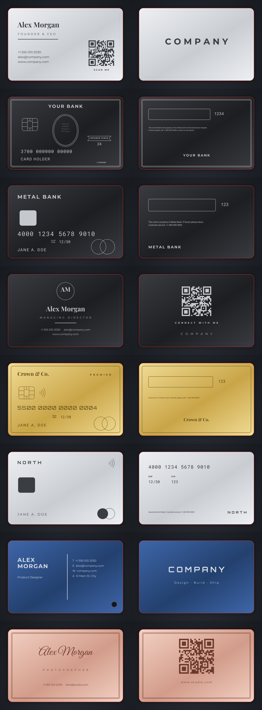
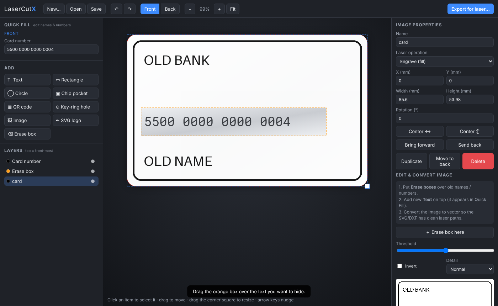
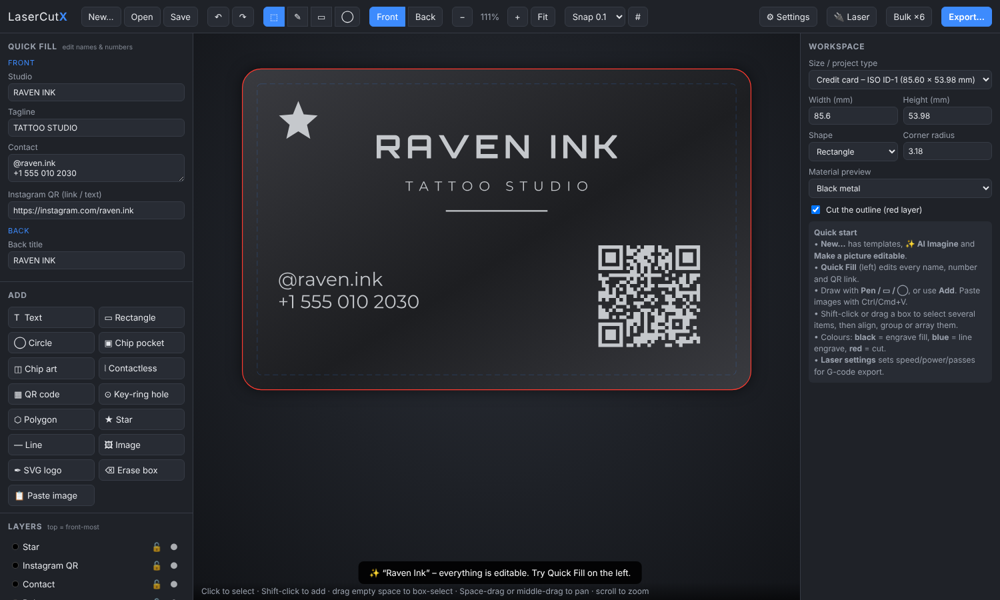
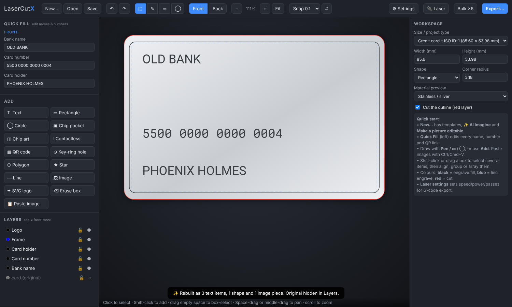
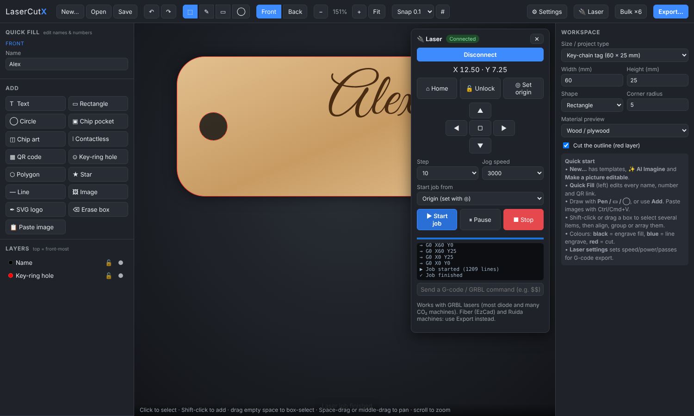

# LaserCutX – Laser Designer

A simple, friendly laser design app (Windows & macOS, or in Chrome/Edge) for **metal business cards**,
**custom metal credit cards** and any other laser project – signs, coasters, tags, ornaments.
Design, make pictures editable with Claude, export laser files, or send the job straight to a USB laser.



## What it does

- **Templates** (all front + back, everything editable):
  - Credit cards: *Classic metal*, *Black charge card (centurion style, Amex-inspired)*, *Minimal brushed steel*, *Gold premium*
  - Business cards: *Classic*, *Executive black (centred)*, *Modern split + key-ring hole*, *Signature script + QR*
  - or blank, or start from an image of a card.

  
- **Quick Fill** – every name, number and QR link is listed in a simple form on the left.
  Just type: card numbers group themselves (`4000 1234 5678 9010`, Amex `3782 822463 10005`),
  expiry becomes `MM/YY`, the card-holder name becomes UPPERCASE.
- **Start from an image of a card** – load a photo/scan/PNG of a design, put an
  **Erase box** over the old name or number, type the new text on top, then
  **Convert to vector (trace)** so the SVG/DXF contains clean laser paths.

  
- **Add** text (6 built-in fonts + load your own TTF/OTF/WOFF), rectangles, circles,
  EMV **chip pocket**, **QR codes**, **key-ring holes**, images and **SVG logos**.
- **Exports** (true millimetre size, ISO ID-1 card = 85.60 × 53.98 mm, r 3.18 mm):

  | Format | Use with | Notes |
  |---|---|---|
  | **SVG** | LightBurn, xTool Creative Space, Glowforge, Inkscape | Black = engrave fill, Blue = line engrave, Red = cut. Text is converted to outlines, so no fonts are needed on the laser PC. |
  | **DXF** (R12) | EzCad (fiber lasers), RDWorks, LaserGRBL, CAD | Layers `ENGRAVE`, `SCORE`, `CUT`. Vectors only – trace images first. |
  | **PNG** | Any raster engraving | 300–1200 DPI, DPI stored in the file so it imports at the right size. Optional invert. |
  | **G-code** | GRBL lasers (LaserGRBL, UGS, or the built-in 🔌 Laser panel) | Uses the per-layer speed/power/passes; fills are hatched; estimated job time shown. |

  Options: front, back or both sides, choose layers, **mirror** for back-side jigs, include/exclude the red card outline.
- **Bulk ×6** – one click lays out 6 copies of the card (3 × 2 grid, 3 mm gap) in a single SVG/DXF/PNG
  so the whole batch runs as one laser job. Copies, columns and gap are adjustable; the dialog shows the
  sheet size so you can check it fits your bed. Shortcut: Ctrl/Cmd + Shift + E.
- Projects save as `.lcx` files (fonts and images included, so they open anywhere).

## Editing tools (LightBurn-style, simpler)

- **Workspaces:** card sizes, key-chain tag, round coaster, sign, A4, 300 × 200 / 400 × 400 laser beds, or a custom size
  (rectangle or round). Materials preview: stainless, black metal, gold, rose gold, anodised, wood, acrylic, leather, slate, paper.
- **Draw:** Pen (click points, click the first point to close), rectangle and ellipse by dragging, polygons and stars,
  lines, text (6 fonts + your own) with **curved text** (bend radius), QR codes, chip, contactless symbol.
- **Select & arrange:** Shift-click or drag a box to select several items; move, rotate (handle, Shift = 15°), resize;
  **align** left/centre/right/top/middle/bottom, **distribute**, **flip**, **group / ungroup**, **lock**, bring forward / send back,
  scale a selection by %, **array** (grid or circular), copy / cut / paste / duplicate, undo / redo.
- **Workspace:** grid with snapping (0.1 – 5 mm), live cursor position and selection size, scroll-to-zoom at the cursor,
  Space- or middle-drag to pan.
- **Images:** paste (Ctrl/Cmd+V) or import; brightness, contrast, gamma, invert; grayscale, threshold or **dither**;
  erase boxes; **trace to vector**.
- **Laser settings** (⚙ Settings → Laser layers): speed, power, passes and line interval per layer, max S value,
  M3/M4, air assist – saved with the project.

| Shortcut | Action |
|---|---|
| V / P / R / E | Select / Pen / Rectangle / Ellipse |
| Ctrl/Cmd + C, X, V, D | Copy, cut, paste, duplicate |
| Ctrl/Cmd + G / Shift+G | Group / ungroup |
| Ctrl/Cmd + A | Select all |
| Arrows (Shift = 1 mm) | Nudge |
| Enter / Esc | Finish / cancel pen path |
| Ctrl/Cmd + E (Shift = bulk) | Export |

## ✨ Claude AI

- **AI Imagine** (New… dialog): describe what you want – *“black metal business card for a tattoo artist called
  Raven Ink with a QR code to my Instagram”* – and Claude lays out an editable design.

  
- **Make editable:** paste or import a picture of a design and click **✨ Make editable with Claude**. Text becomes real,
  editable text (it shows up in Quick Fill), simple parts become shapes, and logos/artwork are cut out as separate image
  pieces you can adjust or trace. The original picture stays hidden in Layers.

  
- **Connect Claude:** the first time you use an AI feature a popup asks for your Claude API key (create one at
  console.anthropic.com → API Keys). You can change or remove it any time in **⚙ Settings → Claude AI**.
  The desktop app stores it encrypted by your operating system; the browser version keeps it in that browser only.
  Usage is billed to your Anthropic account. The app uses Claude Opus 5.5, with Anthropic's automatic fallback model
  if a request is declined.

## 🔌 Send jobs to your laser (USB)

Click **🔌 Laser**, then **Connect via USB** and pick your laser's port. Works with **GRBL** controllers – most diode
lasers (xTool, Ortur, Atomstack, Sculpfun, Creality…) and GRBL-based CO₂ machines.

- Home, unlock, jog (0.1 – 50 mm steps), **set origin**, **frame** the job (laser off), start / pause / stop,
  progress bar, console for raw commands (e.g. `$$`).
- Start the job from the origin you set, the current laser position, or machine 0,0.
- Order: images → fills → lines → cuts, with holes cut before outlines.

Not supported for direct sending: **fiber lasers running EzCad** and **Ruida** CO₂ controllers use closed protocols –
export DXF/SVG and open them in EzCad / RDWorks / LightBurn instead. Always wear laser safety glasses and never leave
a running laser unattended.



## Download / install

Ready-made apps are built by GitHub Actions:

Every push builds the apps automatically (repository **Actions** tab → **Build desktop apps** → latest run →
*Artifacts*). Push a tag such as `v1.0.0` to also publish them on a GitHub Release.

- **Apple Silicon Mac (M1–M4):** `LaserCutX-1.0.0-mac-arm64.dmg` (or `.zip`)
- **Windows 11 (x64):** `LaserCutX-Setup-1.0.0-win11-x64.exe` (installer) or `LaserCutX-1.0.0-win11-x64-portable.exe` (no install)

The apps are not signed with a paid Apple/Microsoft certificate, so the first launch shows a warning:
- **Windows SmartScreen:** click *More info → Run anyway*.
- **macOS:** open the DMG and drag LaserCutX to Applications, then right-click it → *Open* → *Open*.
  If macOS says the app “is damaged”, run this once in Terminal: `xattr -cr /Applications/LaserCutX.app`

## Run from source

Requires [Node.js](https://nodejs.org) 20+.

```bash
npm install
npm start          # desktop app
npm run web        # or run it in Chrome/Edge at http://localhost:5173 (USB + AI work there too)
npm test           # unit tests
npm run dist:win   # build Windows .exe   (run on Windows)
npm run dist:mac   # build macOS .dmg     (run on a Mac)
```

## Tips for metal cards

- Fiber lasers (EzCad): export **DXF** and set fill/hatch for the `ENGRAVE` layer in EzCad.
- CO₂/diode with marking spray or LightBurn: export **SVG**; layers are picked up by colour.
- The **chip pocket** position follows ISO 7816-2 approximately – check it against your chip module before cutting.
- Keep text inside the dashed **safe area** (2.5 mm from the edge).
- Use **Mirror** when engraving the back of a card in a flipped fixture.
- Centred texts (issuer names, names on the centred templates) stay centred as you edit them – toggle
  *Keep centred* in the text properties.
- The centurion-style template has an empty oval: drop your own emblem in with **Image** or **SVG logo**.

## Project layout

```
electron/          desktop shell (window, menu, native save dialogs)
src/index.html     editor UI
src/js/app.js      editor logic
src/js/model.js    card sizes, templates, element → vector geometry
src/js/exporters.js SVG / DXF / raster export
src/js/trace.js    image → vector tracing
src/js/gcode.js    G-code generator (hatch fill, cut ordering)
src/js/machine.js  GRBL USB connection (Web Serial)
src/js/claude.js   Claude AI: Imagine + Make editable
src/js/imaging.js  erase boxes, PNG rendering, SVG logo import
src/vendor/        opentype.js, qrcode-generator, Claude SDK bundle, fonts (OFL) – refresh with `npm run vendor`
tests/             unit tests (node --test)
```

Fonts are licensed under the SIL Open Font License; see `src/vendor/fonts/*.LICENSE.txt`.
